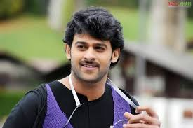

# Chaithanya Reddy Pailla

## Favorite Movie: Darling

*Darling* is my favorite movie because of its **heartwarming story** and 
**Prabhas' stellar performance**. The blend of romance, comedy, and family drama makes it a timeless classic.

---
## Alternate Actors for *Darling*

Here is a list of actors I think would be interesting in the main role for the movie *Darling*, besides Prabhas. These actors could bring their unique styles and charm to the character.

| Actor Name       | Reason for Choosing                             | Age |
|------------------|-------------------------------------------------|-----|
| Nani             | Known for his charm and ability to play roles   | 40  |
| Vijay Deverakonda| Brings raw emotion and intensity to characters  | 26  |
| Ram Charan       | Versatile actor with a strong screen presence   | 39  |
| Allu Arjun       | Known for his energy and dance performances     | 41  |

---
## Favorite Quotes

> "Success comes with hard work, patience, and perseverance."  
*– Prabhas*

> "The true measure of success is how many times you bounce back from failure."  
*– Prabhas*